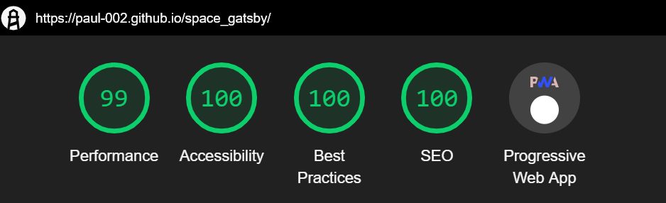
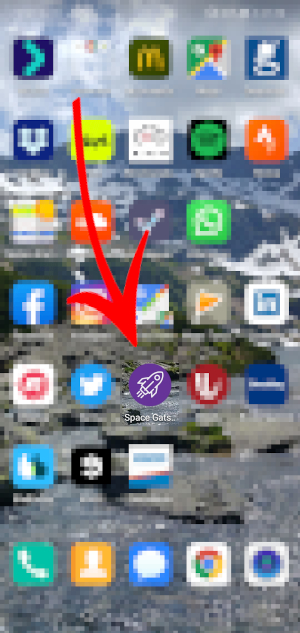
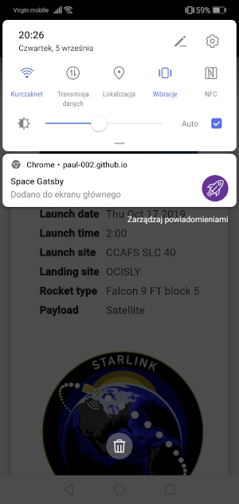
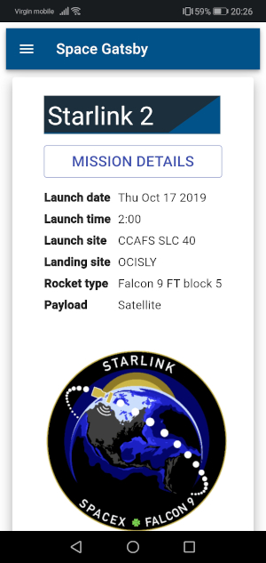
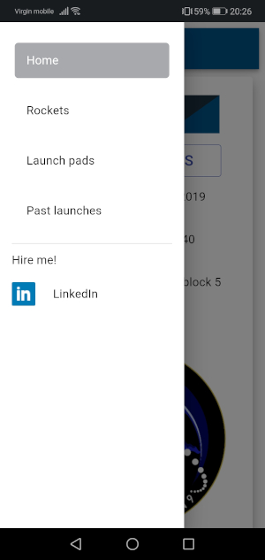
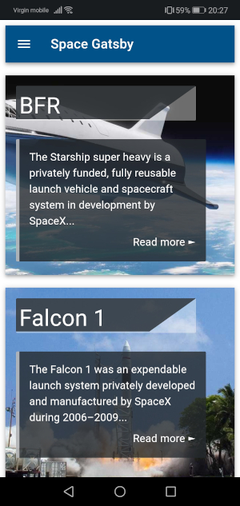
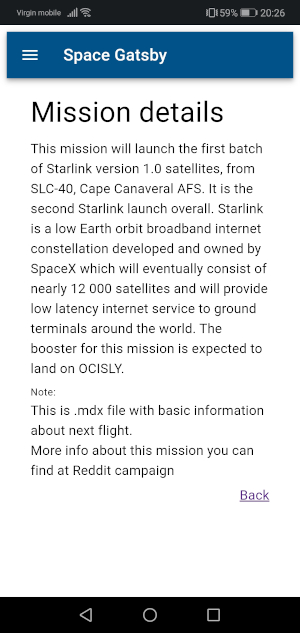

<h1 align="center">Space Gatsby</h1>

The golden times of spaceflight and the first landing of a man on the Moon are long behind us. With the development of technology, uneconomical and outdated shuttles no longer meet their goals. Market demand for new constructions and growing interest in the space sector, and in particular the mining industry on other planets of the Solar System, has created new goals in the astronomical race. In recent times, many private companies have partnered with NASA and in particular one...

## About project :clipboard:

- [General info](#General-info)
- [Technologies](#technologies)
- [Features](#features)
- [Screenshots](#screenshots)
- [Setup](#setup)
- [Status](#status)
- [Inspiration](#Inspiration)
- [Contact](#contact)

## General info

Space Gatsby is React-based, GraphQL powered, static PWA, styled by Google's Material-UI framework. \
As a data source, it uses [converted API](https://api.spacex.land/graphql/) of the public [open source REST API](https://docs.spacexdata.com/?version=latest) created by users of the r/SpaceX tag on the Reddit portal.

## Technologies

- React.js - ^16.8.6
- Gatsby - ^2.13.18
- Material-UI - ^4.2.0
- Mdx-js - ^1.1.1
- Styled-components - ^4.3.2
- Axios - ^0.18.1
- Webpack - ^4.28.4

## Features

List of ready features 🔥

- Creating pages dynamically through third-party GraphQL API,
- Site styled with Google's Material-UI and CSS Modules, RWD,
- Generate new pages programmatically by using .md and .mdx files,
- Countdown timer - check how much time is left until the next take-off,
- Lazy loading images.

In progress

- Page with a list of previous missions.
- Description of take-off along with information on the status of the load and the success of the operation.
- Typing queries with typeof keyword defined in TypeScript.

## Performance

Screenshot from Chrome dev tools audit.

  

## Screenshots

|                  Mobile shortcut icon                   |                   Main screen notification                   |
| :-----------------------------------------------------: | :----------------------------------------------------------: |
|  |  |

&nbsp;

|                   Home screen                   |                      Navigation drawer                      |
| :---------------------------------------------: | :---------------------------------------------------------: |
|  |  |

&nbsp;

|                    Rockets page                     |                  Mission details page                  |
| :-------------------------------------------------: | :----------------------------------------------------: |
|  |  |

## Setup

Before you are ready to run **Space Gatsby** you will need additional software installed on your computer.

### Node.js

Version minimum 8 or later is required. Download the Windows installer from the [Node.js downloads page.](https://nodejs.org/en/download/)

## Instalation

All commands need to be performed in either PowerShell or a Command Shell.

### 1. Install the Gatsby CLI.

`npm install -g gatsby-cli`

### 2. Clone the repository

`git clone https://github.com/Paul-002/space_gatsby.git`

### 3. Enter the directory

`cd space_gatsby`

### 4. Install all dependencies

`npm install`

### 5. Start the development server

`gatsby develop`

## OR

### 4. Prepare front-end assets

`gatsby build`

### 5. Run project on local web server

`gatsby serve`

### See the public [demo](https://paul-002.github.io/space_gatsby/) of Space Gatsby!

## Status

The project is _under development_.

## Inspiration

This app is inspired by Ashlee Vance book [Elon Musk: Tesla, SpaceX, and the Quest for a Fantastic Future](https://www.goodreads.com/book/show/25541028-elon-musk)

### Source of knowledge

- [Gatsby tutorials](https://www.gatsbyjs.org/tutorial/)
- [Gatsby docs](https://www.gatsbyjs.org/docs/)
- [Jason Lengstorf YT channel](https://www.youtube.com/channel/UCnty0z0pNRDgnuoirYXnC5A)
- [Kyle Gill courses](https://egghead.io/instructors/kyle-gill)
- [Mterial-UI docs](https://material-ui.com/getting-started/usage/)

## License

This project is licensed under the MIT License.

## Contact

Created by :wave: [@Paul-002](https://github.com/Paul-002)
